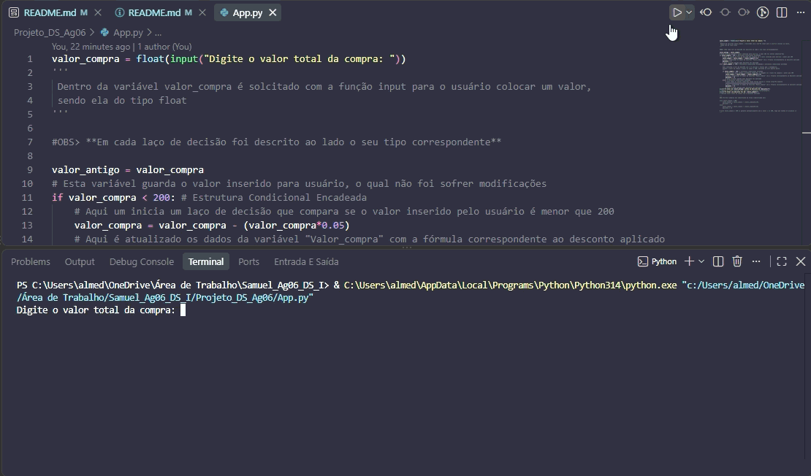

# Agenda 06 - Estrutura de Decisão 📊
* Este repositório têm como objetico apresentar um programa solicitado na agenda 6 de DS, com a finalidade desmontrar
estruturas de decisão em Phython.

## 🧠 Como funciona? 
1. Dentro da variável valor_compra é solcitado com a função input para o usuário colocar um valor,
sendo ela do tipo float;

2. Em uma váriavel é guardado o valor inserido para usuário, o qual não foi sofrer modificações;

3. Se inicia um laço de decisão que compara se o valor inserido pelo usuário conforme a situação;

4. É atualizado os dados da variável "Valor_compra" com a fórmula correspondente ao desconto aplicado;
>_ valor_compra = valor_compra - (valor_compra*"Valor em decimal do desconto do laço)_

5. Uma várivel chamada "Desconto" guarda o valor do desconto;

6. Caso todas as outras condições sejam falsas aplica a última situação exposta;

7. Imprime os valor inserido pelo usuário e o desconto correspondente;

8. Imprime valor total da compra com o desconto aplicado.

## ⚙️ Exemplo do Código rodando
<div align="center" alt="Gif" width="350" height="auto">
    
    <p><strong>Execução do Código</strong></p>
</div>

## 🛠️ É possível simplificar alguma parte? 
No Elif poderia ser substituido de forma simplificada por:

````
elif valor_compra < 300:
    valor_compra = valor_compra - (valor_compra*0.10)
    desconto = 10 
else
    valor_compra = valor_compra - (valor_compra*0.15)
    desconto = 15
````

_O elif valor_compra < 300 já garante automaticamente que o valor é >= 200, logo que falhou no primeiro if._